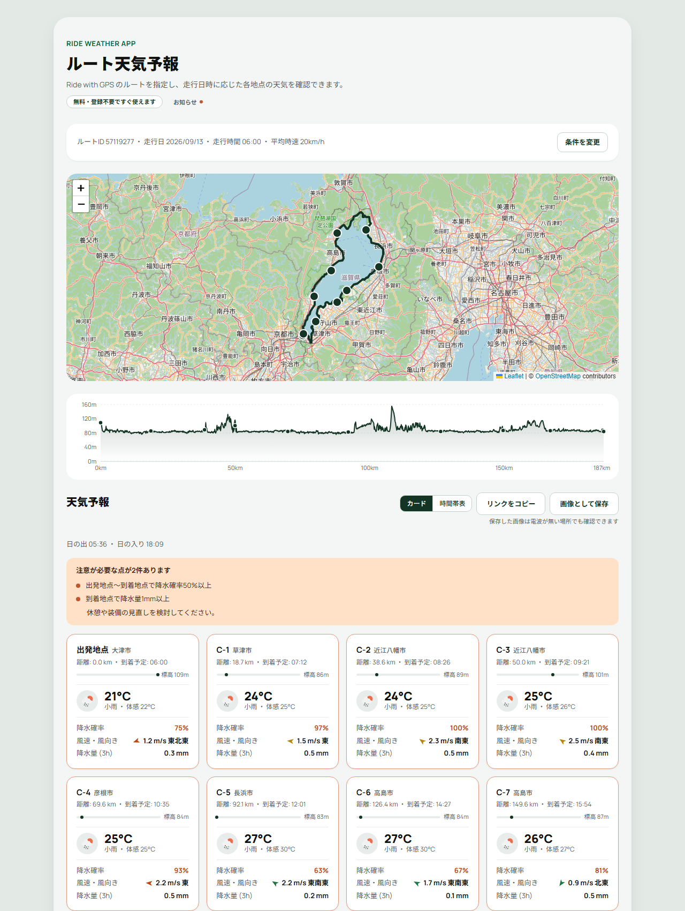
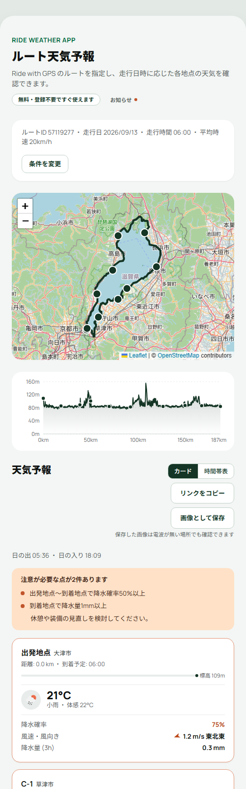
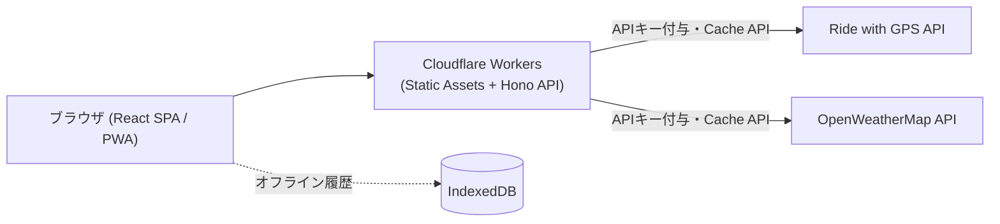

# RideWeather

Ride with GPS のサイクリングルート(または GPX/TCX ファイル)を指定すると、出発時刻と平均時速から**ルート上の各地点に何時に着くか**を計算し、**その時刻・その場所の天気予報**を一括表示する Web アプリです。アカウント登録不要・無料で、PWA としてホーム画面に追加して使えます。

**公開URL: https://ride-weather-app.nacci-dev.workers.dev**
稼働状況: [Status Page](https://stats.uptimerobot.com/5gHN9iYYFl)

個人開発のプロダクトで、2026年8月に公開して以降、本番稼働しています。本リポジトリはその公開用スナップショットです(詳細は「[このリポジトリについて](#このリポジトリについて)」)。

<p align="center">
  
</p>

<p align="center">
  
</p>

<p align="center"><sub>ビワイチ(琵琶湖一周・187 km)を 6:00 出発・平均時速 20 km/h で表示した例(本番環境の実データ)。<br>地点ごとの到着予定時刻とその時刻の予報、注意が必要な区間の要約バナーが出ている。</sub></p>

## なぜ作ったか

ロングライドでは、出発地点の天気が良くても、3時間後に通る峠で雨に降られたり向かい風に変わったりします。一般の天気アプリは「今いる場所」「指定した1地点」の予報しか出さないため、**移動しながら時間も場所も変わっていく**というサイクリング特有の条件に答えてくれません。

そこで「ルート・出発時刻・平均時速」から各地点の到着時刻を計算し、**その時刻の、その地点の予報**を並べて見せるツールを作りました。同種のサービス(EPICRideWeather 等)はサブスク課金や分単位予報を強みにしていますが、本アプリは「無料・登録不要」「インストール不要の PWA」「一目で分かる警告」に絞っています。

## 主な機能

- **ルート上の代表地点(既定10地点)の天気を一括表示** — 到着予定時刻を算出し、その時刻の気温・体感温度・降水確率・風速風向・降水量を表示
- **到着予定時刻の補正** — 平均時速そのままではなく、獲得標高(登りの所要時間増)と走行距離に応じた休憩時間を加味した補正を ON/OFF できる
- **天候警告の自動判定** — 降水確率50%以上・風速4m/s超・降水量1mm以上・体感温度33℃以上/5℃以下・ルート内の体感温度差10℃以上・夜間到着を検知し、要約バナーとカードの枠線色で警告
- **追い風/向かい風の可視化** — 進行方向と風向から、地点ごとに追い風・向かい風を矢印で表示
- **地図・標高グラフ・時間帯別の天気表** — 地図(Leaflet)、標高プロファイル、時間帯マトリクス表示を連動表示
- **GPX/TCX アップロード対応** — Strava・Garmin Connect など Ride with GPS 以外のルートも読み込める
- **オフライン履歴** — 取得済みの結果を IndexedDB に自動保存(直近10件)し、電波の無い場所でも見返せる
- **URLでの結果共有** — 条件を URL クエリパラメータ化して共有・復元できる(アカウント不要)
- **画像として保存** — 天気カード一覧を画像としてダウンロード/共有できる
- **PWA 対応** — ホーム画面に追加してアプリのように起動でき、オフラインでも起動する

## アーキテクチャ

フロントエンド(React SPA)と API プロキシ(Hono)を**同一の Cloudflare Workers プロジェクト**にまとめてホスティングしています。OpenWeatherMap・Ride with GPS の API キーは Workers 側の Secrets に保持し、ブラウザには一切渡しません。



リクエストフロー・コンポーネント構成の詳細な図解は [docs/DESIGN.md](docs/DESIGN.md)、コードの読み進め方は [docs/CODE_READING_GUIDE.md](docs/CODE_READING_GUIDE.md) を参照してください。

## 技術スタック

| 領域 | 選定 |
|---|---|
| フロントエンド | React 19 + TypeScript + Vite |
| UIコンポーネント | MUI |
| サーバー状態管理 | TanStack Query |
| 地図・グラフ | Leaflet (react-leaflet) / Recharts |
| バックエンド | Cloudflare Workers + Hono |
| テスト | Vitest (+ @testing-library/react, fake-indexeddb, jsdom) |
| Lint | Oxlint |
| PWA | vite-plugin-pwa (Workbox, generateSW) |
| 画像エクスポート | html2canvas |

## 主な設計判断

- **フロントと API を1つの Workers プロジェクトに同居させた** — Pages + Functions ではなく Static Assets 一体型。デプロイ単位が1つで済み、同一オリジンになるため CORS 設定が不要になる
- **API キーはサーバー側にのみ置く** — 旧実装(CRA)は `REACT_APP_*` でキーをクライアントバンドルに埋め込んでいた。作り直しの主目的の一つがこの解消で、現在はブラウザに一切渡していない
- **ライブラリを足す前に標準機能で足りないか見る** — GPX/TCX パースはブラウザ標準の `DOMParser` による自前実装、オフライン履歴はネイティブ IndexedDB(ラッパーライブラリなし)。バンドルサイズがすでに大きく、依存を増やす判断のハードルを上げている
- **夜間判定は自前計算せず OWM のアイコンコードを使う** — `sunrise`/`sunset` との時刻比較は、タイムゾーンや日付跨ぎを自前で扱うことになる。OWM が地点・時刻ごとに判定済みのアイコンコード末尾(`n`/`d`)をそのまま使う方式に統一した
- **地名表示はローマ字にフォールバックしない** — OWM の `city.name` は日本の地方部だとローマ字や都道府県止まりになる。Geocoding reverse の `local_names.ja` を主経路にし、日本国内で日本語名が取れない場合はローマ字を出すより非表示にする(粗くても日本語 > 正確なローマ字)
- **結果表示部を動的 import で分離** — Leaflet と Recharts がメインバンドルの大半を占めていたため `React.lazy`/`Suspense` で分離。現在のメインチャンクは 671 kB(gzip 205 kB。`npm run build` の出力値)
- **表示コンポーネントの寸法定数を Skeleton 側から参照する** — プレースホルダーが実レイアウトとずれてレイアウトシフトを起こすのを防ぐため、寸法をハードコピーせず export して共有している

## テスト

`vitest run` で **27ファイル・323ケース**が通ります(型チェック `tsc -b`、`oxlint`、本番ビルドもすべて通過)。

- **ロジックに寄せる** — 到着時刻計算・地点抽出・警告判定・URL 状態・GPX/TCX パース・逆ジオコーディング等の純粋関数を厚くテストする
- **壊れやすい UI 操作は避ける** — MUI の日付/時刻ピッカーを jsdom 上で開閉操作するのは保守コストに見合わないため、初期値を注入した状態から入力検証ロジックを検証する
- **IndexedDB は `fake-indexeddb` で実際に読み書きする** — 旧形式レコードとの互換性(後述)も含めてテストしている
- **jsdom の限界を認識する** — jsdom 上の性能計測は実ブラウザと大きく乖離する(巨大 XML の `children` アクセスが極端に遅い等)。巨大データの性能検証は `wrangler dev` で実機確認している
- **マージ前に別セッションで多角的レビューを実施** — 実装時の思い込みを引きずらないよう、レビューは実装とは別のコンテキストで行う運用にしている(詳細は [CLAUDE.md](CLAUDE.md))

## 本番運用

認証なしの公開アプリで、無料枠の外部 API を叩くため、乱用対策を前提に設計しています。

- **Secrets** — `RWGPS_API_KEY` / `OWM_API_KEY` は `wrangler secret` で Workers 側に保持。リポジトリにもクライアントバンドルにも含めない
- **レート制限** — Cloudflare Workers の Rate Limiting binding(IPベース)。`/api/route` 30req/分、`/api/weather` 60req/分
- **キャッシュ** — Cache API でレスポンスをキャッシュ(ルート6時間、天気30分、逆ジオコーディング結果30日)。緯度経度を丸めた値と対象日時をキーにして、近接リクエストの重複を削減する
- **Origin/Referer チェック** — `/api/*` は同一オリジンからのリクエストのみ受け付ける。ヘッダー詐称で回避できるため主目的の防御ではなく、レート制限と組み合わせた多層防御の1枚として置いている
- **セキュリティヘッダー** — `public/_headers` で CSP・`X-Frame-Options: DENY`・`nosniff`・`Referrer-Policy` 等を付与
- **エラー情報を利用者に出さない** — 本番ではスタックトレース等の内部情報をコンソールに出力しない(開発時のみ出力)
- **可観測性** — Workers の observability を有効化

## 本番稼働中に起きた不具合と、そこから決めたルール

**IndexedDB のスキーマ変更でアプリ全体がクラッシュした。**

オフライン履歴レコードの型を `fileName: string` から `source: OfflineHistorySource` に変更した際、マイグレーションを入れませんでした。IndexedDB はスキーマレスなので、**コード側の型定義を変えても、利用者のブラウザに保存済みの古い形のレコードはそのまま残ります。** 結果、旧形式のレコードを持つブラウザでは履歴の保存が永久に止まり、一覧表示中にアプリ全体がクラッシュする状態になりました(事後の多角的レビューで発見し、読み取り境界での正規化で修正)。

型チェックもテストもビルドも通っていたため、静的な検査では一切検知できませんでした。ここから決めたルール:

- 保存済みレコードの型を変えるときは、**マイグレーション(`DB_VERSION` を上げて `onupgradeneeded` で変換)か、読み取り境界での防御的な正規化のどちらかを必ず入れる**
- 既存データが本番にあり得るスキーマ変更では、実装時点で「過去のレコードはこの新しい型に本当に合致しているか」を必ず自問する
- 正規化を入れる際は、**同じ型の他のフィールドも漏れなく対象にする**(実際、後続のレビューで `source` は正規化していたが `arrivalCorrectionEnabled` が漏れていたことが見つかった)

この教訓を含め、繰り返し踏んだ落とし穴は [CLAUDE.md](CLAUDE.md) に記録しています。

## AI エージェントとの開発体制

実装は Claude Code(AI コーディングエージェント)に委任し、自分は要件定義・設計判断・レビュー体制の設計に集中しました。委任して終わりにせず、**エージェントの運用そのものを設計対象として扱っています。**

- **前提を [CLAUDE.md](CLAUDE.md) に資産化する** — 守らせるルール、踏んだ落とし穴、コーディング規約を1ファイルに集約し、セッションが変わっても同じ失敗を繰り返させない。上に書いた IndexedDB の教訓も、MUI `Skeleton` の既定 `height` が `aspect-ratio` を無効化する件も、`@testing-library/react` の自動クリーンアップが `globals: true` 無しでは効かない件も、すべてここに入っています
- **実装とレビューのコンテキストを分ける** — 各 STEP のマージ前に、**実装とは別セッション**で多角的コードレビューを実施します。実装時の思い込みは自己レビューでは原理的に拾えないためで、実際にこの運用で High 級のバグを複数発見しています(上記の IndexedDB 障害もその一つ)
- **フェーズごとにモデルを使い分ける** — 敵対的検証(Verify)は推論力の高いモデル、レビューの集約とレポート生成は通常のモデル、と精度が要る工程にコストを寄せています
- **静的検査で拾えない領域を人間が引き取る** — Service Worker の登録確認やレイアウトの実測など、エージェントの実行環境では検証できないことが分かっている項目は、確認の担当を明示的に分けています

## セットアップ

```bash
npm ci
```

`.dev.vars` に API キーを設定します(gitignore 対象。リポジトリには含まれません)。

```
RWGPS_API_KEY=your_ridewithgps_api_key
OWM_API_KEY=your_openweathermap_api_key
```

## ローカル実行

```bash
npm run start   # ビルド後 wrangler dev を起動 (http://localhost:8787)
```

`npm run dev` は Vite 単体の dev サーバーで、フロント側の見た目確認には使えますが `/api/*` は動作しません(バックエンド込みで動かす場合は `npm run start`)。

## テスト・型チェック・ビルド

```bash
npm run test    # Vitest
npx tsc -b      # 型チェック
npm run lint    # Oxlint
npm run build   # 本番ビルド
```

## デプロイ

```bash
npx wrangler login
npx wrangler secret put RWGPS_API_KEY
npx wrangler secret put OWM_API_KEY
npx wrangler deploy
```

## ドキュメント

- [docs/DESIGN.md](docs/DESIGN.md) — 設計書(要件・アーキテクチャ・API 仕様・図解・意思決定の記録)
- [docs/CODE_READING_GUIDE.md](docs/CODE_READING_GUIDE.md) — 処理フローと、どのファイルから読み進めるとよいかのガイド
- [docs/REFACTOR_BACKLOG.md](docs/REFACTOR_BACKLOG.md) — レビューで見つかったが見送っている構造改善のバックログ
- [docs/TEST_IMPROVEMENT_PLAN.md](docs/TEST_IMPROVEMENT_PLAN.md) — STEP6 時点のテスト評価と補強計画(指摘事項は STEP7 で解消済み。当時の評価の記録として残しています)
- [CLAUDE.md](CLAUDE.md) — AI コーディングエージェント向けのガイドライン。開発コマンド・厳守ルール・繰り返し踏んだ落とし穴
- [docs/design_handoff_ride_weather_ui/](docs/design_handoff_ride_weather_ui/) — UI リデザインのハンドオフ資料

## このリポジトリについて

開発は別の非公開リポジトリで行っており、本リポジトリは**現時点のファイルを公開用に切り出したスナップショット**です(コミット履歴は含みません)。コードやドキュメント中に `plans/` や `docs/PROGRESS.md` への参照が残っているのは、それらが非公開リポジトリ側にあるためで、判断の出どころを消さないようあえて残しています。

## ライセンス

[MIT License](LICENSE)
