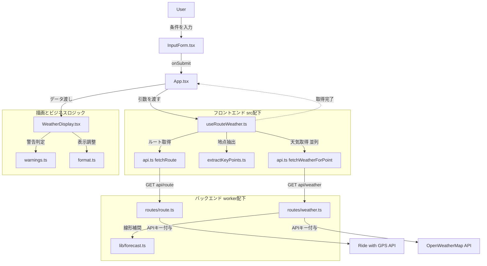

# コードリーディングガイド (ジュニアエンジニア向け)

本ドキュメントは、Ride Weather App のコードベースを理解するためのガイドです。
全体の処理フローと、どのファイル・メソッドから読み進めるべきかのおすすめ順序をまとめています。

## 1. 処理フローとメソッド間の繋がり

ユーザーがフォームに入力してから、バックエンドを経由して外部APIからデータを取得し、画面に描画されるまでの一連の流れです。

## 2. おすすめの読み進め方

上記の図を踏まえ、以下の順番でコードを読むとデータがどのように加工され、流れていくのかをスムーズに理解できます。

### Step 1: バックエンド（出入り口とキャッシュ）
- **`worker/index.ts`**
  - HonoのAPI初期設定箇所です。セキュリティヘッダーなどがここで設定されています。
- **`worker/routes/route.ts`** および **`worker/routes/weather.ts`**
  - フロントエンドからのリクエストを受け取り、外部APIを呼び出す部分です。
  - Cloudflareの **キャッシュ** や **レート制限** をどのように実装しているかを確認してください。

### Step 2: フロントエンドのデータフェッチ（心臓部）
- **`src/features/weather/useRouteWeather.ts`**
  - **このアプリで一番重要なファイルです。** React Queryを使用してデータを取得しています。
  - ルートの取得が終わった後、抽出された地点ごとに `Promise.all` を用いて並列で天気予報を取りに行くロジックを読み解いてください。

### Step 3: UIとビジネスロジックの分離
- **`src/App.tsx`**
  - Step 2 のフック（`useRouteWeather`）を呼び出し、取得したデータを地図や天気一覧に配る親コンポーネントです。
- **`src/components/WeatherDisplay.tsx`**
  - 取得したデータを画面のカードとして描画しています。
- **`src/features/weather/warnings.ts`**
  - 「気温が33度以上なら警告を出す」などのビジネスロジックが、UIから純粋な関数として独立していることを確認してください。
