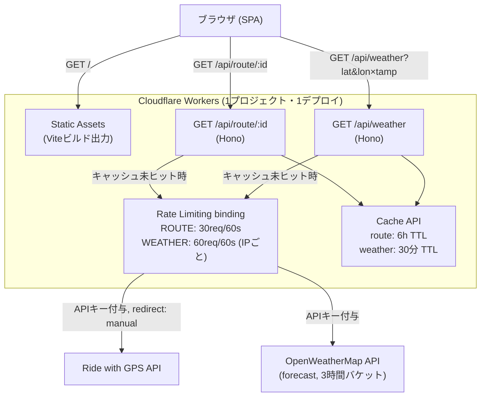
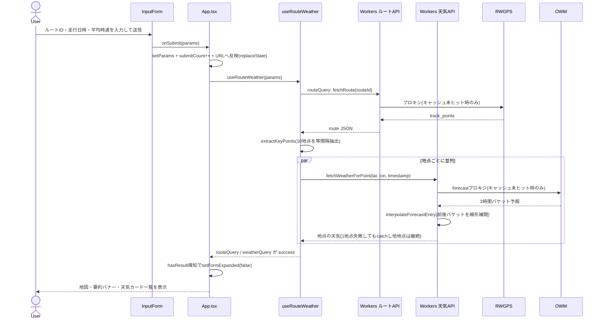
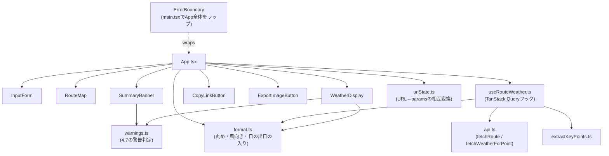

# Ride Weather App 設計書 (作り直し版)

最終更新: 2026-08-16
ステータス: デプロイ済み(公開URL: https://ride-weather-app.nacci-dev.workers.dev)

> **このリポジトリについて**: 本リポジトリは開発用リポジトリのスナップショットです。本文中で参照している作業ログ(`plans/`)・多角的レビューの依頼プロンプト(`docs/review/`)・進捗記録(`docs/PROGRESS.md`)・機能選定の壁打ちメモは、開発用リポジトリ側に置いており、ここには含めていません(リンクはしていませんが、経緯を示すため参照元の記述はそのまま残しています)。

## 1. 目的・背景

Ride with GPS で作成したサイクリングルートに対して、指定日のルート上各地点の天気予報を一括表示するWebアプリ。個人のGW等のライド計画用に開発していたが、旧実装(CRA + Redux Toolkit)はテスト周りの不整合とAPIキーのクライアント露出を抱えたまま中断していた。今回は設計・スタックを見直して作り直す。

将来的にポートフォリオとして公開し、広告収入も視野に入れる。そのため「個人の非公開ツール」ではなく「認証なしの公開Webアプリ」として、API乱用防止を前提に設計する。

## 2. 旧実装からの主な変更点

| 項目 | 旧実装 | 新実装 |
|---|---|---|
| ビルドツール | CRA (craco) | Vite |
| 言語 | JavaScript | TypeScript |
| 状態管理 | Redux Toolkit | TanStack Query (サーバー状態) + useState (UI状態) |
| APIキー | `REACT_APP_*` でクライアントバンドルに埋め込み | Cloudflare Workers 経由でサーバー側に隠蔽 |
| 地図 | Leaflet を依存に持つが実際は未使用、RWGPS埋め込みiframeを表示 | Leaflet依存を削除、iframe埋め込みを継続 (※後日STEP1で自前描画に再転換。4.5参照) |
| ホスティング | 未デプロイ | Cloudflare Workers (Static Assets 一体型) |
| テスト | CRA標準 (Jest) | Vitest |
| オフライン | 非対応 | 結果ページの画像エクスポート機能を主軸 |
| 公開範囲 | 想定不明確 | 認証なし公開 + レート制限/キャッシュで乱用防止 |

## 3. 全体アーキテクチャ



- フロントとAPIプロキシを **同一 Cloudflare Workers プロジェクト** にまとめる(Pages+Workersの2構成にしない)。同一オリジンなのでCORS設定不要、デプロイも1コマンドで完結。
- APIキー(`RWGPS_API_KEY`, `OWM_API_KEY`)は `wrangler secret put` でWorkersのSecretsに登録し、コード・クライアントバンドルには一切含めない。
- キャッシュヒット時はレート制限チェック自体をスキップする(乱用防止の意図に対して過剰に厳しくならないよう、実際に上流APIを叩く時だけ消費する設計)。

### 3.1 リクエストフロー(シーケンス図)

送信ボタンを押してから天気カードが表示されるまでの流れ。ルート取得(`routeQuery`)が成功した後、抽出した代表地点(既定10地点)ぶんの天気取得(`weatherQuery`内で`Promise.all`)が並列実行される。



## 4. 機能要件

### 4.1 入力
- Ride with GPS のルートID または ルートURL
- 走行日(今日〜5日後まで。OpenWeatherMap無料プランの予報範囲に合わせる)
- 走行開始時刻・平均時速(**当日/未来日を問わず常に表示・必須**。詳細は下記「出発時刻の扱い」)
- 走行日はMUIの`DatePicker`(`@mui/x-date-pickers` + `dayjs`)、走行開始時刻は同じく`TimePicker`(`@mui/x-date-pickers`)を使用。ネイティブ`<input type="date">`/`<input type="time">`はブラウザ間で見た目が揃わないため採用しなかった
- 送信成功後はフォームを折りたたみ、送信条件のサマリー+「条件を変更」ボタンに置き換える(天気カードまでのスクロール量を減らす目的)。再度展開した際は直前の入力値を保持する(`InputForm`に`initialValues`propで渡す)
- **入力値のローカルキャッシュ**(`src/features/weather/localCache.ts`): 出先での再入力の手間を減らすため、送信成功時にルートID・平均時速を`localStorage`に保存し、次回アプリを開いた際(URLでの状態復元が無い場合のみ)に自動で埋める。走行日・時刻はライドごとに変わるため対象外とし、従来通り「今日〜5日後の範囲」「フォームを開いた時点の現在時刻」を初期値にする。URLクエリパラメータでの状態復元(4.9参照)がある場合はそちらを優先し、キャッシュでは上書きしない

**出発時刻の扱い(設計変更の経緯)**: 当初は「当日はチェックボックスで時刻指定を任意にし、未指定時は現在時刻の実況天気(`current` API)を取得する」設計だったが、チェックボックスOFF時に「何時基準の天気を見ているか」が画面上どこにも表示されず分かりにくいというユーザー指摘を受けて撤回。現在は**時刻欄を常時表示し、フォームを開いた時点の現在時刻を初期値として埋める**方式に変更した(`dayjs().format('HH:mm')`)。ユーザーは初期値のまま送信することも、任意の時刻に変更することもできる。この変更に伴い`current` APIの利用はフロントエンドから削除し、**常に`forecast`(3時間刻み予報の線形補間、4.2参照)に統一**した。
- 「今日」の判定はブラウザのローカルタイムゾーンで行う(`getTodayLocalDateString`、`getFullYear/getMonth/getDate`ベース)。`toISOString().split('T')[0]`はUTC基準になるため、JST(UTC+9)環境では深夜0:00〜8:59に「今日」が「明日」と誤判定されるバグがあり、修正済み

### 4.2 処理フロー
1. ルートIDを `/api/route/:id` 経由で取得(track_pointsを含む)
2. ルート上から代表地点を抽出(4.3参照)
3. 各地点について、出発時刻・距離・平均時速から到着予定時刻を算出
   - 基本式: `到着予定時刻 = 出発時刻 + (地点までの距離 ÷ 平均時速)`
   - **STEP7以降**: 既定でこの基本式に獲得標高補正・休憩時間補正を加算する(ユーザーがトグルでOFFにすれば上記の単純計算のみに戻せる)。詳細は4.14参照
   - 算出した到着予定時刻の天気を`forecast`予報から取得する。OpenWeatherMap無料プランの予報データは3時間刻みのため、対象時刻を挟む前後2バケットから**気温・体感温度・風速・降水確率を線形補間**して分単位の到着時刻に対応させる(`worker/lib/forecast.ts`の`interpolateForecastEntry`)。天気アイコン・説明文・降水量・風向きのような補間になじまない値は、対象時刻に近い方のバケットの値をそのまま使う
4. 各地点の天気を `/api/weather` 経由で取得し、一覧表示

### 4.3 代表地点の抽出ロジック
初期実装は現行踏襲で **固定10地点を等間隔抽出**。ただし将来「距離ベース(例: 20kmごと)」に切り替えられるよう、抽出ロジックをストラテジーとして分離しておく。

```ts
type PointExtractionStrategy =
  | { mode: 'fixedCount'; count: number }
  | { mode: 'byDistance'; intervalMeters: number };

function extractKeyPoints(
  trackPoints: TrackPoint[],
  strategy: PointExtractionStrategy = { mode: 'fixedCount', count: 10 }
): TrackPoint[]
```

呼び出し側は `strategy` を意識せず結果の配列だけを使うため、後から `byDistance` 実装を追加してデフォルトを差し替えるだけで済む。

### 4.4 天気表示項目
- 天気アイコン・説明
- 気温・**体感温度** (`main.feels_like`)。カード表示は整数に丸める(`Math.round`)。API値そのまま(小数点2桁)は情報過多なため
- 降水確率(`pop`、前後バケットから線形補間)
- 風速・風向(風速は線形補間、風向きは対象時刻に近い方のバケット値を使用。表示は「北」「北北東」等の16方位の日本語表記。当初はカード高さのばらつきを避けるためコンパス略号(N/NNE/NE...)にしていたが、ユーザー要望により日本語表記に戻した(`getWindDirectionLabel`))
- 降水量(3h、対象時刻に近い方のバケット値をそのまま使用)
- **日の出・日の入り**: 地点間でほぼ同じ値になるため、カードごとの繰り返し表示はやめ、地図の下に1回だけ表示する(`getRouteSunTimes`、ルート内で最初にsunrise/sunsetが取得できた地点の値を採用)。取得元は `forecast` API の `city.sunrise/sunset`(追加API呼び出し不要)
- **標高**: RWGPSのtrack_pointsに含まれる`e`フィールド(メートル)をカードに表示し、ルート内の最高標高〜最低標高を正規化した簡易バー(ミニインジケーター)を添える。上部の標高プロファイルグラフと天気カード一覧のつながりを視覚的に補強する目的
- **地点名**: カードのタイトルは`出発地点`/`到着地点`/`C-N`(中間地点の連番)で固定表示する。RWGPSのキューポイント名やOWMの逆ジオコーディング地名は日本語/ローマ字が混在し表記が不揃いになるため、タイトルには使わず`placeName`として補足表示する(いずれも追加API呼び出し不要)
  - 補足地名の優先順: 1. RWGPSのtrack_pointが持つキューポイント名(`n`フィールド、付与されている地点のみ) 2. OpenWeatherMapのレスポンスに含まれる逆ジオコーディング地名(`city.name`) 3. いずれもなければ非表示
- 未取得値の表示は英語の"N/A"ではなく`ー`(全角ダッシュ)を使う。和文UIに英語表記が混ざると読みにくいため

### 4.5 地図表示
Leaflet(`react-leaflet`)による自前描画に切り替えた(**方針転換**。当初は「旧実装で未使用のまま依存していたため削除、Ride with GPSの埋め込みiframeを使用」としていたが、`docs/IMPROVEMENT_PLAN.md` STEP1で以下の理由により再導入した)。

- **理由**: 埋め込みiframeはクロスオリジンのためhtml2canvasで中身をキャプチャできず、「地図込みの完全な画像保存」がブラウザのセキュリティ制約上不可能だった(4.6の既知の制約として記載していた問題)。自前描画にすることでこの制約が外れ、地図・標高グラフ・天気予報を1枚に収めたシェア画像が作成可能になる
- **実装方針**: `track_points`(RWGPSレスポンスに全点分の座標・標高が既に含まれる)からポリライン・マーカーを描画。地図タイルはAPIキー不要のOpenStreetMap標準タイルを使用(実機で`Access-Control-Allow-Origin: *`を返すことを確認済み)。html2canvasでの画像化に対応するため、`<TileLayer crossOrigin="anonymous">` + `<MapContainer preferCanvas={true}>`(SVGレンダラーがhtml2canvasでキャプチャ漏れする事故を防ぐ) + `html2canvas({ useCORS: true })` の組み合わせを採用
- 詳細な実装フェーズは `plans/STEP1_IMPLEMENTATION_PLAN.md` を参照

### 4.6 画像エクスポート(オフライン対策の主軸)
結果画面に「画像として保存」ボタンを設置し、`html2canvas` 等でDOMをキャプチャして画像ファイルとしてダウンロード/共有できるようにする。出発前(電波がある場所)にこの画像を保存しておけば、走行中に電波が無くても画像ビューアで予報内容を確認できる。

**(STEP1で解消済み)**: 旧実装(iframe埋め込み地図)では`html2canvas`がクロスオリジンiframeの中身をキャプチャできず(ブラウザのセキュリティ制約でcanvasが汚染される)、地図をエクスポート対象から除外し天気カード一覧のみを対象にしていた。4.5の通り地図をLeafletによる自前描画に切り替えたことでこの制約が解消され、**地図・標高グラフ込みでエクスポート可能**になった。エクスポート対象は「地図→標高グラフ→(日の出日の入り→要約バナー→天気カード一覧 or 時間帯マトリックス、画面上のトグルに従う)」を縦に並べたもの(実測: 実ルートで1032×1597pxのPNG、約370KB)。
`html2canvas`(v1.4.1)はCSS Color 4の`oklch()`を解釈できないため、デザイントークンはhex固定にしている(11章参照)。地図タイル・天気アイコンはクロスオリジン画像のため、`html2canvas`呼び出し時に`{ useCORS: true }`を指定している(`ExportImageButton.tsx`)。

**実装上の簡略化(計画からの変更点)**: 当初計画(`plans/STEP1_IMPLEMENTATION_PLAN.md`)では、画面表示とは別に4:5や9:16など画像保存に最適化した専用レイアウト(`ShareableView`)を裏側でレンダリングする想定だったが、実装では別コンポーネントを新設せず、既存の画面表示(地図・標高グラフを含めるよう`App.tsx`の`exportTargetRef`の範囲を拡張)をそのままエクスポート対象にする、より単純な方式を採った。画面上で「時間帯表(マトリックス)」に切り替えていれば、縦に長くなりすぎない画像が得られる。専用の縦長最適化レイアウトが本当に必要かは、実際に長いルートで画像を確認したうえで判断すること。

**画像保存フロー・出力フォーマットの改善(2026-08-16、`plans/IMAGE_EXPORT_IMPROVEMENTS_PROGRESS.md`参照)**: iOS Safariは`<a download>`のPNGを常にQuick Look(プレビュー)で開いてしまい直接保存できないため、Web Share API(`navigator.canShare`/`navigator.share`、ファイル共有)対応環境ではそちらを優先し、非対応環境のみ従来の`<a download>`(Blob URL方式に変更)にフォールバックするようにした。あわせて、長距離ルートで出力ファイルが数十MBに達する問題(1,302kmルートで19.1MB)に対応するため、出力フォーマットをPNG→JPEG(quality 0.92、背景は常に不透明のためアルファチャンネルは元々不要)に変更し、`html2canvas`の`scale`を`Math.min(window.devicePixelRatio, 2)`で上限2倍にキャップした(既定値は`window.devicePixelRatio`そのままで、iPhone Pro等の3倍環境×長距離ルートの幅広テーブルの掛け合わせがサイズ膨張の主因だった)。

### 4.7 天候警告表示
ルート上の地点・区間ごとに、走行に影響しそうな条件を検知して警告表示する(`src/features/weather/warnings.ts`)。判定は既存の天気データのみから計算する純粋関数で、追加のAPI呼び出しは不要。

**地点単位の警告**(該当する天気カードの枠線・該当項目の文字色を変える):
| 条件 | 閾値 |
|---|---|
| 降水確率 | 50%以上 |
| 風速 | 4m/s超 |
| 降水量 | 1mm以上(3h換算) |
| 高温注意(体感温度) | 33℃以上 |
| 低温注意(体感温度) | 5℃以下 |
| 夜間の到着(STEP5) | 到着予定時刻のOWM天気アイコンが夜間(末尾'n') |

**夜間判定の実装方針(STEP5)**: `sunrise`/`sunset`との時刻比較ではなく、`WeatherMatrix.tsx`が時間帯表の夜間列判定で既に採用しているOWMアイコンコード末尾('n'=夜間/'d'=日中)方式を`getPointWarnings`にも使う。地点・時刻ごとにOWM側で判定済みの値をそのまま使え、タイムゾーンや日付跨ぎを自前計算する必要がないため。`docs/IMPROVEMENT_PLAN.md`原文の「カードをダークモード風にし専用バッジを表示」という案は、費用対効果を見て既存の警告システム(枠線色・要約バナー)への統合にとどめた(壁打ちの経緯は`docs/次期機能選定_壁打ちプロンプト.md`参照)。

**ルート単位の警告**:
| 条件 | 閾値 |
|---|---|
| 気温差(ルート内の最高体感温度地点−最低体感温度地点) | 10℃以上 |

地図と天気予報カード一覧の間に「要約バナー」(`src/components/SummaryBanner.tsx`)を設置し、**常に表示する**。警告該当がなければ「本日のライドは概ね良好な天候です」という落ち着いたトーンの一文を、該当があれば「注意が必要な点が{件数}件あります」という見出し+詳細を表示する(送信直後に一目で全体傾向を把握できるようにするため、以前の「該当時のみ表示」から変更)。**地点単位の注意(降水確率/降水量/風速/高温/低温)と気温差(ルート全体の相対的な注意)は性質が異なるため、視覚的に別グループとして表示する**(気温差は"↕"アイコン付き・上に区切り線)。地点単位の注意は理由ごとに区間(先頭〜末尾の地点名)を1行ずつ表示する。

サマリーを読まなくても該当箇所が分かるよう、気温差の最高地点・最低地点のカードには「▲最高」(暖色)「▼最低」(寒色、`tokens.cold`)バッジを表示する。

### 4.8 PWA化(STEP3)
`manifest.json`(ホーム画面追加用、初期実装時に作成済み)に加え、STEP3で`vite-plugin-pwa`(Workbox、`generateSW`モード)を導入し、Service Workerによる静的アセットのキャッシュを実装した。詳細な実装ログ・技術的懸念の検討経緯は`plans/STEP3_IMPLEMENTATION_PLAN.md`・`plans/STEP3_PROGRESS.md`を参照。

**キャッシュ戦略**: Service Workerでキャッシュするのは静的アセット(HTML/CSS/JS/画像/フォント/`manifest.json`)のみ。`/api/route`・`/api/weather`はキャッシュ対象に含めない(`navigateFallbackDenylist`で`/api/*`を除外)。天気予報は鮮度が重要なデータであり、SWがHTTPレベルで古いレスポンスを黙って返すと天候警告の判定結果ごと古くなる実害があるため。STEP2のIndexedDBオフライン履歴(4.10節)は「ユーザーが明示的に保存したスナップショット」であり保存日時をUIに明示するのに対し、SWのHTTPキャッシュはこの文脈情報を伝えられない、という設計上の違いを踏まえた判断。地図タイル(OpenStreetMap)も同様の理由に加えOSMの利用規約への配慮からキャッシュ対象外とし、オフライン時は地図タイルが表示されない(空白)ことを既知の制約として許容する。

**更新戦略**: `registerType: 'prompt'`を採用し、`autoUpdate`(無断でのリロード)は使わない。新バージョンが待機状態になったら`PwaUpdatePrompt.tsx`(`virtual:pwa-register/react`の`useRegisterSW`フック使用)がMUIの`Snackbar`で「新しいバージョンがあります」+「更新」ボタンを表示し、ユーザーの明示的な操作でのみ`updateServiceWorker(true)`(SKIP_WAITING→リロード)を実行する。走行日時・平均時速を入力中に予告なくコンテンツが切り替わるのを避ける狙い。

**複数タブ対応(コードレビューで発見・対応済み)**: `useRegisterSW`は`onNeedReload`未指定の場合、新SWが有効化されると(Service Worker仕様上`controllerchange`が同一登録の全クライアントに届くため)「更新」を押していない別タブも含め無条件で`window.location.reload()`する標準動作になっている。これだと複数タブを開いている場合に、他タブの未送信の入力やURLに残らないアップロード結果(GPX/TCX)が予告なく失われる。`PwaUpdatePrompt.tsx`では`onNeedReload`を指定し、「更新」を押したタブ自身(`reloadRequestedRef`で判定)のみ即リロードし、他タブは「新しいバージョンに切り替わりました。再読み込みしてください」という控えめな通知に留める実装にしている。

**オフライン時のAPI失敗時の挙動**: `useOnlineStatus`(`src/features/weather/useOnlineStatus.ts`、`navigator.onLine`を`useSyncExternalStore`でラップ)でオフライン状態を検知し、`App.tsx`の`routeQuery.isError`/`weatherQuery.isError`表示時、オフライン起因と判定した場合はオフライン起因の案内文言(「オフライン履歴」への導線を追記)に差し替える。オフライン履歴の保存対象がRWGPS/アップロード両方に拡張された(STEP3完了後の追加対応)ため、この案内も入力元を問わず表示する。

**実装中に発見・修正したバグ(STEP3の副産物)**: TanStack Queryの既定`networkMode: 'online'`は、`navigator.onLine`がfalseになると初回の`fetch()`すら実行せず`fetchStatus: 'paused'`のまま無言でハングする(`isError`にならないため、上記のオフライン向け文言の分岐に到達しない)。`src/main.tsx`の`QueryClient`に`defaultOptions.queries.networkMode: 'always'`を追加し、常に実際のfetchを試行させて失敗を`isError`として扱うよう修正した。この問題自体はSTEP1/STEP2時点から潜在していた(送信中にオフラインになるケースをこれまで検証していなかった)。

**コードレビューで発見・修正した設計ギャップ**: `weatherQuery`は`fetchWeatherPoint`(`useRouteWeather.ts`)が地点ごとの失敗をtry/catchで飲み込み常に成功扱いでresolveする設計(1地点の失敗で全体を落とさないための既存設計)のため、実際には`isError`にならない。そのため上記のオフライン向け文言(`routeQuery.isError`/`weatherQuery.isError`起点)は`weatherQuery`側では機能せず、特にアップロードルート(`routeQuery`はネットワーク不要で即成功)でオフライン時に天気取得のみ失敗するケースでは案内文言が一度も表示されない設計ギャップがあった。既存の「1地点失敗で全体を落とさない」設計自体は妥当なため維持し、代わりに地点ごとのエラーメッセージ自体(`describeWeatherFetchError`)をオフライン時に和文の分かりやすい文言に差し替えることで対応した。あわせて、エラー表示に使う`isOnline`はライブ値ではなく「エラー発生時点のスナップショット」にする修正も行った(ライブ値だと、オンライン中の別原因のエラー直後にオフラインになった場合に誤った文言が出る不整合があったため)。

**CSPとの整合性**: `public/_headers`の`script-src 'self'`はCSPの`worker-src`未指定時のフォールバック仕様により追加ディレクティブなしでService Workerの登録・fetchイベントを許可する。`sw.js`のレスポンスヘッダは`Cache-Control: public, max-age=0, must-revalidate`(Cloudflare Workers Static Assetsの既定)で、SW自体が更新検知を妨げるほど長くキャッシュされることはないため`public/_headers`の追加変更は不要だった。

**既知の制約(このセッションでは検証未完了)**: 開発に使用したBrowser pane(Electron埋め込みwebview)ではService Worker登録自体が`TypeError: ... An unknown error occurred when fetching the script.`で失敗する(`'serviceWorker' in navigator`はtrueだが`register()`が常に失敗。最小構成のテスト用JSファイルでも再現するためCSP/コード起因ではないと判断)。SW登録・オフライン起動・更新通知フローの実ブラウザでの最終確認はユーザー自身のChromeで実施する必要がある(詳細はplans/STEP3_PROGRESS.md参照)。

**バンドルサイズ削減(leaflet/recharts動的import化)は当時見送り**: precacheはオフライン描画を保証するため両ライブラリのチャンクをいずれにせよ含める必要があり、動的import化のメリットは初回オンライン訪問の表示速度のみ(STEP4寄りの改善)と判断したため。**→ STEP4で実施済み(4.11参照)**。

### 4.9 差別化・共有機能
同種の既存サービス(例: EPICRideWeather。サブスク課金・マルチプラットフォーム連携・分単位予報などが強み)との比較検討をユーザーと行い、「無料・登録不要」「インストール不要のPWA」「一目で分かる警告」という3本柱で差別化する方針とした。具体的には以下を実装:

- **ヘッダーバッジ**: 「無料・登録不要ですぐ使えます」の一文をヘッダーに常時表示し、初見のユーザーに利用障壁の低さを伝える
- **総合判定の常時表示**: 4.7の要約バナーを警告有無に関わらず常に表示し、送信直後に全体傾向が分かるようにする
- **URL共有**: 送信条件(ルートID・走行日・走行時間・平均時速・STEP7以降は到着時刻補正のON/OFF)を`URLSearchParams`でクエリパラメータ化し、`window.history.replaceState`でURLに反映する(`src/features/weather/urlState.ts`)。「リンクをコピー」ボタン(`src/components/CopyLinkButton.tsx`)で`navigator.clipboard.writeText(window.location.href)`によりURLをコピーでき、アカウント無しでも結果を仲間と共有できる
  - URLを直接開いた場合は`decodeParamsFromSearch`で状態を復元する。route/date/time/speedのいずれかが欠けている、routeIdが数字でない、走行日が過去日である(古い/壊れた共有リンクとみなす)、speedが0以下、のいずれかに該当する場合は不正なリンクとして無視し、通常の空フォーム状態にフォールバックする
- **オフライン訴求**: 「画像として保存」ボタンの下に「保存した画像は電波が無い場所でも確認できます」のキャプションを添え、4.6のオフライン対策(画像エクスポート)の使い所を明示する

### 4.10 GPX/TCXアップロード対応(STEP2)
Ride with GPS以外(Strava・Garmin Connect等)のルートにも対応するため、GPX/TCXファイルをブラウザ上でパースし、RWGPS由来のルートと同じ表示パイプラインに流し込めるようにした。詳細な実装ログは`plans/STEP2_PROGRESS.md`を参照。

**ルート入力元の抽象化**: `RouteWeatherParams.routeId: string | null` を `routeSource: RouteSource | null` に置き換え、`{type:'rwgps', routeId}` / `{type:'upload', fileId, fileName, trackPoints}` のUnion型にした。`useRouteWeather`の`routeQuery`はこの型で分岐し、アップロード時はネットワークを叩かず既存の`RwgpsRouteResponse`形状にそのまま詰め替える。これによりRouteMap/ElevationChart/WeatherMatrix/ShareableView等の表示コンポーネントは無改修でRWGPS/アップロードの両方に対応できている。

**GPX/TCXパース**(`src/features/weather/gpxTcxParser.ts`): ライブラリを追加せず、ブラウザ標準の`DOMParser`で自前パースしている(STEP1でバンドルサイズが増加した経緯を踏まえ、依存追加を避ける方針)。GPX/TCXともXML名前空間を持つため`getElementsByTagNameNS('*', localName)`または直接の子要素走査でローカル名ベースに要素を探す。累積距離は、TCXの`DistanceMeters`が全点で取得できかつ単調増加している場合のみそのまま採用し、それ以外(GPX全般、TCXで欠損/不整合)はHaversine公式で座標間距離を積算する。**実測でjsdom(テスト環境)特有の性能劣化(`children`アクセスが数万要素規模で極端に遅い)を発見したが、実ブラウザでは9.5MB/27,241点のファイルでもパース+描画1.6秒と問題なかった**(教訓の詳細はSTEP2_PROGRESS.md参照)。

**オフライン履歴**(`src/features/weather/offlineHistory.ts`): 天気取得結果をネイティブIndexedDB(ライブラリ追加なし)に自動保存する。表示用に`extractKeyPoints`で座標を間引いてから保存し、保存件数は直近10件のFIFOで維持する。`App.tsx`は「オフライン履歴から選択したデータ」と「ライブクエリ結果」を`displayTrackPoints`/`displayWeatherPoints`に一本化し、以降の表示コンポーネントはデータの出所を意識しない。**(STEP3完了後に拡張)** 当初はアップロードファイル由来の結果のみが対象(RWGPSルートは「routeIdがあればオンライン復帰後いつでも再取得できる」という理由で対象外)だったが、その前提がSTEP3の想定シーン(電波のない山中で、出発前に見たRWGPSルートを見返したい)と噛み合わないと判明したため、RWGPSルートも保存対象に含めるよう拡張した。レコードの入力元は`OfflineHistorySource`型(`{type:'rwgps',routeId}` / `{type:'upload',fileName}`)で表現し、保存時の重複判定(`sourcesEqual`)もこの型で行う。詳細は`plans/STEP3_PROGRESS.md` Phase9参照。

**UI**(`src/components/UploadAccordion.tsx`・`src/components/OfflineHistoryPanel.tsx`): アップロード自体は既存のRWGPS入力欄を邪魔しないよう、既定で閉じたアコーディオン形式で提供する(ファイル添付中はRWGPSのルートID欄を無効化し、両方を同時に使えない仕様)。**オフライン履歴の一覧UIは当初`UploadAccordion`内にあったが、RWGPSルートも保存対象になったことで「アップロード専用の折りたたみの中」という置き場所ではRWGPS利用者が気づけない問題が生じたため、`OfflineHistoryPanel.tsx`として独立させ、フォーム内の常時表示(履歴が1件以上ある場合のみ)に昇格した。**

**URL共有・ローカルキャッシュの非対応**: アップロードされたファイルの座標データ(数千〜数万点)はURLクエリパラメータに載せられる量ではないため、`urlState.ts`の`encodeParamsToSearch`は`routeSource.type === 'rwgps'`の場合のみエンコードする。同様の理由でルートIDのローカルキャッシュ(`localCache.ts`)もRWGPS限定のまま。

### 4.11 UXの仕上げ(STEP4)

Skeleton UIとバンドルサイズ削減(4.8で見送った動的import化)を実施した。詳細な実装ログ・技術的懸念の検討経緯は`plans/STEP4_IMPLEMENTATION_PLAN.md`・`plans/STEP4_PROGRESS.md`を参照。

**Skeleton UI**(`src/components/ResultSkeleton.tsx`、新規): 天気APIのデータ取得中(`Promise.all`の待ち時間)に、地図・標高グラフ・天気カード/時間帯表それぞれの実レイアウト(高さ・列数)に近いプレースホルダーを表示する。カード枚数/行数は`extractKeyPoints.ts`の既定値(`DEFAULT_KEY_POINT_COUNT`=10)、時間帯表のテーブル幅算出式は`WeatherMatrix.tsx`の`LABEL_COLUMN_MIN_WIDTH`/`DATA_COLUMN_MIN_WIDTH`をそれぞれexportして再利用し、実コンポーネントとの寸法の重複管理を避けている。`App.tsx`では「まだ結果が無い初回取得中」のみSkeletonを表示し、「結果表示済みでのバックグラウンド再取得中」は従来の`CircularProgress`のまま(実データが再取得のたびにSkeletonへ置き換わる退行を避けるため)。

**MUI Skeletonの罠(実機で発見)**: `variant="rectangular"`でも`width`/`height`未指定だと既定で`height: 1.2em`が設定され、CSSの`aspect-ratio`(対象辺が`auto`の場合のみ効く仕様)が無効化される。地図のプレースホルダーが厚さ約19pxの薄い帯にしかならないバグとして実機で発覚し、`height: 'auto'`の明示で解消した(詳細はCLAUDE.mdの落とし穴・`plans/STEP4_PROGRESS.md`参照)。

**動的import化**(`RouteMap`/`ElevationChart`): `App.tsx`・`ShareableView.tsx`の両方で`React.lazy`+`Suspense`化し、leaflet/rechartsをメインバンドルから分離した。両ファイルで同じモジュール指定子を動的importする必要がある(片方だけ静的importのままだと依存グラフ経由でメインチャンクに巻き戻り、分割効果が消える)。`Suspense`のfallbackはSkeletonコンポーネントを再利用し、「データ取得中」と「チャンク読み込み中」のどちらでも同じプレースホルダーが出る。メインチャンクは1,238.49 kB(gzip 374.48 kB)→732.44 kB(gzip 226.68 kB)に削減(約40%減)。

**多角的レビュー対応**(`docs/review/STEP4レビュー依頼プロンプト.md`、詳細は`plans/STEP4_PROGRESS.md` Phase7参照): `ResultSkeleton.tsx`に`SummaryBanner`相当のプレースホルダーが欠落していたバグ、時間帯表の天気アイコンサイズ不一致(24px vs 実際32px)を修正。あわせて、`RouteMap.tsx`/`ElevationChart.tsx`/`WeatherDisplay.tsx`/`WeatherMatrix.tsx`から寸法定数(aspectRatio・height・padding・グリッド設定・フォントサイズ等)をexportし、Skeleton側がハードコピーせず参照する構造に変更(値ドリフトの再発防止)。`App.tsx`に`params.routeSource`変化時のprefetch(`import('./components/RouteMap')`等)を追加し、Suspenseのチャンク取得が天気データ取得と並行して開始されるよう変更(以前は`hasResult`確定後まで開始されず、低速回線で追加の直列待ちが発生しうる構造だった)。

### 4.12 小粒改善まとめ(STEP5)

`docs/次期機能選定_壁打ちプロンプト.md`での壁打ちの結果、`docs/IMPROVEMENT_PLAN.md`のキラー機能アイデアとは別に決まった4項目をまとめて実装した。詳細は`plans/STEP5_IMPLEMENTATION_PLAN.md`・`plans/STEP5_PROGRESS.md`を参照。

- **走行日のデフォルト当日化**: `InputForm.tsx`の`selectedDate`初期値を`selectedTime`と同じ方針(`getTodayLocalDateString()`)に揃えた。モバイルの日付ピッカーは未選択でも「今日」をハイライト表示するため見た目上は選択済みに見え、そのまま送信するとバリデーションに引っかかる、というギャップを解消した
- **夜間の到着警告**: 4.7参照
- **オフライン履歴のルートタイトル保存**(`OfflineHistorySource`のrwgpsヴァリアントに`title?: string`を追加): RWGPS APIレスポンスに既に含まれる`route.name`を、実際に保存するタイミング(`routeQuery.data`確定後)で合成する。`title`はoptionalフィールドの追加であり、STEP3 Phase9のような既存フィールドの構造変更とは性質が異なるため、`DB_VERSION`のマイグレーションは不要と判断した(既存レコードは`title: undefined`として扱われるだけで型・実行時とも破壊されない)。表示は`formatOfflineHistorySourceLabel`でtitle優先(`${title}(ID: ${routeId})`)、title無し(旧レコード)は従来通りルートIDのみにフォールバックする
- **案内ページ**(`src/components/InfoDialog.tsx`、`src/features/info/`新規): 更新履歴・今後のロードマップ・よくある質問を表示するMUI `Dialog`。CRM等の複雑な仕組みは使わず、`src/features/info/announcements.ts`にハードコードした配列を直接編集する運用にした(更新のたびにコードを1行足して通常のSTEPフローでデプロイする)。ルーティングライブラリの追加も無し。未読管理は`localCache.ts`と同じ`localStorage`パターン(`useUnreadAnnouncement.ts`)

### 4.13 風向き矢印・地図/グラフ/表の連動(STEP6)

`docs/次期機能選定_結論.md`での優先順位付けと、`docs/STEP6機能設計_壁打ちプロンプト.md`での壁打ちの結果決まった2機能をまとめて実装した。いずれも表示層の拡張で、既存の到着時刻計算やデータ保存(コア計算)には触れない。詳細は`plans/STEP6_IMPLEMENTATION_PLAN.md`・`plans/STEP6_PROGRESS.md`を参照。

**風向き矢印**(`src/components/WindArrow.tsx`新規): 天気カード・時間帯表の風速・風向き表示に、向かい風(赤、`tokens.warning`)・追い風(緑、`tokens.windTailwind`新規追加)・横風(琥珀、`tokens.crosswind`新規追加)を色分けした矢印アイコンを追加した。追い風の色は当初`tokens.accent`(既存のブランドカラー)を流用していたが、時間帯表の小さいアイコン(14px)だと暗すぎてほぼ黒に見え「緑と分かりにくい」というユーザーの実機フィードバックを受け、より明るく彩度の高い専用トークン`windTailwind`(`#1a7a43`)に差し替えた。判定ロジック(`src/features/weather/bearing.ts`新規)は、代表地点(既定10点)間の直線から大圏方位角(進行方向ベアリング)を算出し、風向き(`wind.deg`、気象学の慣例で「風が吹いてくる方向」)との相対角度を45度/135度の閾値で向かい風・追い風・横風の3分類に判定する。矢印自体は気象学の慣例とは逆の「風が吹いていく方向」を指すようにしている(追い風なら進行方向と同じ向きを指す方が直感的なため)。ベアリングの算出単位を代表地点間の直線に留めた(生座標`TrackPoint`単位まで精緻化しない)のは、矢印アイコンが小さく体感できる精度差ではないと判断したため。`WeatherMatrix.tsx`のセルへの追加は、バックエンド(`worker/routes/weather.ts`)がOWMの生バケットを`wind`込みでそのまま返していたことが判明し、フロント側(`api.ts`の`normalizeNearbyBuckets`)が`wind`を捨てていただけだったため、バックエンド変更なしで実現できた。

**地図・標高グラフ・天気表の連動ハイライト**: `App.tsx`に共有state(`pinnedDistanceMeters`=クリックでの固定選択、`hoverDistanceMeters`=ホバー中の一時プレビュー、実効値は後者優先)を追加し、`RouteMap`(`CircleMarker`のクリック)・`ElevationChart`(`AreaChart`のホバー/クリック、`window.matchMedia('(hover: hover)')`でタッチデバイスのホバー誤動作を回避)・`WeatherMatrix`/`WeatherDisplay`(受信のみ、選択中の行/カードを強調表示)に配線した。地点の同一性は配列インデックスではなく`distanceMeters`(既存コードで地点の一意なキーとして使われている値)で判定する設計にした。`WeatherMatrix`/`WeatherDisplay`は内部で配列を独自にソートしており、`RouteMap`はソートしないため、インデックスの一致に依存すると将来の実装変更で暗黙に壊れうるという判断から。画像エクスポート専用の`ShareableView.tsx`にはこれらのpropsを一切渡していないため、意図しないハイライトの写り込みは構造的に発生しない。

**標高グラフのホバー位置を地図上の任意地点として表示(ユーザー実機フィードバックを受けた追加)**: 天気表・地図マーカーの強調は代表地点(WeatherPoint、既定10点)単位でしか表現できないが、「峠のピーク等、代表地点以外の位置も地図で確認したい」という要望を受け、標高グラフのホバー/クリック位置を代表地点に丸め込まず、生の距離のまま`RouteMap`に伝えるようにした。`interpolateTrackPosition`(新規、`src/features/weather/interpolateTrackPosition.ts`)が生座標(`TrackPoint`、密な点列)から任意距離の座標を線形補間で算出し、`RouteMap`はその位置に既存のチェックポイントマーカー(緑丸)とは別の白丸ドットを描画する。天気表向けの丸め込み済みの値(`highlightedDistanceMeters`)と、地図ドット向けの生の値(`rawHighlightDistanceMeters`)を`App.tsx`で分けて保持している。

### 4.14 到着予定時刻の精度向上・休憩時間補正(STEP7)

`docs/次期機能選定_結論.md`で「到着時刻計算のコアに影響するため単独STEP」と位置づけられていた項目。`docs/STEP7機能設計_壁打ちプロンプト.md`での壁打ちの結果、当初案(獲得標高補正のみ)に休憩時間補正とON/OFFトグルを追加して実装した。詳細は`plans/STEP7_IMPLEMENTATION_PLAN.md`・`plans/STEP7_PROGRESS.md`を参照。

**補正の計算式**(`src/features/weather/calculateArrivalTime.ts`新規): 固定の経験則定数(壁打ちで合意、将来ユーザー調整可能にする場合の差し替えポイントとして分離)を使い、以下の順序で加算する。

1. 平坦所要時間 = 距離 ÷ 平均時速
2. 獲得標高補正: 獲得標高100mにつき`ELEVATION_CORRECTION_MINUTES_PER_100M`(=4分、ロードバイクの体感則3〜5分/100mの中間値)を加算 → 移動時間
3. 休憩時間補正: 移動時間(1と2の合計)を基準に、走行1時間につき`REST_MINUTES_PER_RIDING_HOUR`(=10分)を加算。**休憩時間そのものを基準に含めると計算が循環するため、あくまで移動時間だけを基準にする**

下り区間の時短補正は入れていない(過度に複雑にしないという一貫方針)。獲得標高100mあたりの分数という単一の係数は、勾配が急なほど本来の実質所要時間との乖離が大きくなる(急坂ほど過小評価、緩斜面ほど過大評価になりやすい)という精度限界があることを認識した上で、目安としての実装割り切りとして採用している。

**獲得標高の累積計算**(`elevationGainAtDistances`): 表示用に間引いた代表地点(既定10点)同士の標高差ではなく、間引き前の生`trackPoints`を1回スキャン(マージスキャン、O(n))して各代表地点までの累積獲得標高(上りの標高差の合計、下りは無視)を求める。代表地点だけを見ると、その間にある短く急な峠が直線補間で潰れて見落とされるため。

**ON/OFFトグル**(`RouteWeatherParams.arrivalCorrectionEnabled`、必須boolean): `InputForm.tsx`にSwitchを追加(既定ON)。OFF時は上記補正を一切適用せず、従来通りの単純計算(基本式のみ)に戻す。トグル値は以下に波及する:
- `urlState.ts`: `correction`クエリパラメータ(省略時はtrue扱い。URLは過去の計算結果のスナップショットを持たず開いた時点の現在ロジックで再計算するだけなので、STEP7以前の共有URLも新しい既定動作(補正あり)で自然に再現できる)
- `offlineHistory.ts`: `OfflineHistoryRecord.params`にoptionalフィールドとして追加(構造変更ではないためDB_VERSIONのマイグレーション不要、STEP5の`title?`追加と同じパターン)。**urlStateとは意図的に非対称なデフォルトにしている**: STEP7以前に保存されたレコード(フィールド無し)は、実際には補正なしの単純計算で`weatherPoints`が計算・保存されているため、読み取り境界(`normalizeRecord`)で`undefined`を明示的に`false`へ正規化する(保存済みスナップショットとの整合性を優先。urlStateは逆に「常に現在のロジックで再計算する」ため`true`がデフォルトで正しい)。保存時の重複判定にもトグル値の比較を追加している(異なるトグルで取得した結果を誤って同一視しないため)
- `useRouteWeather.ts`: `weatherQuery`の`queryKey`にトグル値を含める(`routeQuery`には含めない。ルートのtrackPoints自体はトグルに依存しないため)。OFF時は`elevationGainAtDistances`の呼び出し自体をスキップする(三項演算子で未評価、無駄なO(n)スキャンを避ける)

**多角的コードレビューで発見・修正したHigh級バグ**(`docs/review/STEP7レビュー依頼プロンプト.md`、Verify: Opus): `elevationGainAtDistances`が、2点目以降は「標高欠損=直前値を引き継ぐ(差分0)」で統一していたのに、先頭trackPointの標高欠損だけを決め打ちの`0`で扱っていた。2点目以降に実測標高(例: 450m)が初めて現れると、その絶対値が丸ごと獲得標高としてカウントされ、エラーも出ないまま到着予定時刻が実測で約21分ずれる不具合だった(GPXアップロード由来のルートで先頭点のみ標高欠損というデータ形状は実運用上ありうる)。先頭点も「実測標高が最初に現れた地点を基準にする」方式に統一し、基準が定まるまでの区間は加算しないよう修正した。同じレビューで、`offlineHistory.ts`の`normalizeRecord`が`source`のみ正規化し`arrivalCorrectionEnabled`を正規化していなかった点(STEP3 Phase9のsource正規化漏れと同型のリスクパターン)も修正済み。

## 5. API設計 (Workers / Hono)

### `GET /api/route/:id`
Ride with GPS のルートJSONをそのままプロキシ。
- Workers側でAPIキーを付与してRWGPSへリクエスト
- レスポンスをCache APIで短時間キャッシュ(同一ルートの再取得を抑制。ルートは頻繁に変わらないため数時間〜1日程度のTTLも検討)

### `GET /api/weather?lat=..&lon=..&timestamp=..`
OpenWeatherMapの `forecast` エンドポイントをプロキシし、対象日時を挟む前後2つの3時間バケットから気温・体感温度・風速・降水確率を線形補間して返す(補間ロジックはWorkers側に集約し、フロントは「見たい地点・日時」を渡すだけにする。4.2参照)。
- `timestamp`はISO 8601 UTC文字列(`Z`終端、例: `2026-08-16T06:00:00.000Z`)のみ受け付ける。以前は`date`+`time`(クライアントのローカル壁時計文字列)を別々に受け取っていたが、Workers側でタイムゾーン指定なしの日時文字列をパースするとランタイムのローカルタイムゾーン(=UTC)として解釈され、クライアント(JST)の意図と最大9時間ズレる不具合が本番で発生した(2026-08-15 実測で確認)。クライアント側で確定させた絶対時刻を1本の文字列として渡すことで、この曖昧さ自体をなくしている
- 緯度経度を丸めた値+対象日時単位でCache APIキャッシュ(近隣リクエストの重複を削減)

### 乱用防止
- Cloudflare の Rate Limiting(WorkersのRate Limiting binding、またはダッシュボードのレート制限ルール)をIPベースで設定
- 上記キャッシュと合わせ、OpenWeatherMap/Ride with GPSの無料枠(呼び出し回数上限)を超えないようにする
- 具体的な閾値は実装時にOWM/RWGPSの利用規約上限を確認して決定
- **Origin/Refererチェック**(`worker/index.ts`): `/api/*`への直接叩きを抑止する多層防御。このアプリは`route.ts`/`weather.ts`のホストが固定なので任意サイトへのオープンプロキシ(SSRF)にはならないが、認証なし公開のため「RWGPS/OWMへの匿名プロキシ」として無関係な用途に乱用されうる(例: route idを連番で叩いてRWGPSのルートデータを一括スクレイピングする等)。`Origin`優先・無ければ`Referer`で自オリジンとの一致を確認し、不一致なら403を返す。ヘッダーは詐称可能なため主目的の防御ではなく、雑なスクリプトによる直接叩きを防ぐ位置づけ。判定不能(両ヘッダーとも無し)な場合は正規ユーザーを誤って弾かないよう許可する

## 6. 技術スタック

| 領域 | 選定 |
|---|---|
| ビルド | Vite |
| 言語 | TypeScript |
| フロントフレームワーク | React |
| サーバー状態管理 | TanStack Query |
| UIコンポーネント | MUI |
| バックエンド | Cloudflare Workers + Hono |
| ホスティング | Cloudflare Workers (Static Assets 一体型、Pages不使用) |
| テスト | Vitest |
| 画像エクスポート | html2canvas (本番動作確認済み。oklch非対応のためデザイントークンはhex固定、11章参照) |
| PWA | manifest.json + `vite-plugin-pwa`(Workbox `generateSW`、静的アセットのみキャッシュ。4.8参照) |
| GPX/TCXパース | ブラウザ標準DOMParser(自前実装、ライブラリ追加なし。4.10参照) |
| オフライン履歴 | ネイティブIndexedDB(ライブラリ追加なし。4.10参照) |
| Skeleton UI | MUI `Skeleton` + 結果表示部の`React.lazy`/`Suspense`(4.11参照) |
| 案内ページ | MUI `Dialog`(ルーティングライブラリ追加なし、4.12参照) |

## 7. ディレクトリ構成

主要ファイルのみ抜粋(テストファイル `*.test.ts` 等は省略)。

```
rideweather/
├── docs/
│   ├── DESIGN.md
│   ├── CODE_READING_GUIDE.md
│   ├── REFACTOR_BACKLOG.md
│   ├── TEST_IMPROVEMENT_PLAN.md
│   └── design_handoff_ride_weather_ui/  # デザイン案(参照用)
├── public/
│   ├── manifest.json
│   └── _headers          # 静的アセット向けセキュリティヘッダ
├── src/
│   ├── main.tsx
│   ├── App.tsx
│   ├── theme.ts           # MUIテーマ + デザイントークン
│   ├── components/
│   │   ├── InputForm.tsx
│   │   ├── RouteMap.tsx
│   │   ├── WeatherDisplay.tsx
│   │   ├── SummaryBanner.tsx   # 天候警告の要約バナー(常時表示)
│   │   ├── ExportImageButton.tsx
│   │   ├── CopyLinkButton.tsx  # URL共有(4.9)
│   │   ├── UploadAccordion.tsx # GPX/TCXアップロードUI(4.10)
│   │   ├── OfflineHistoryPanel.tsx # オフライン履歴一覧UI(4.10、RWGPS/アップロード共通)
│   │   ├── PwaUpdatePrompt.tsx # Service Worker更新通知UI(4.8)
│   │   ├── ResultSkeleton.tsx  # Skeleton UI(4.11、RouteMap/ElevationChartのSuspense fallback兼用)
│   │   ├── InfoDialog.tsx      # 案内ページ(4.12)
│   │   └── ErrorBoundary.tsx
│   └── features/
│       └── weather/
│           ├── useOnlineStatus.ts   # navigator.onLine検知(4.8)
│           ├── useRouteWeather.ts   # TanStack Queryフック
│           ├── extractKeyPoints.ts  # 4.3の抽出ロジック
│           ├── warnings.ts          # 4.7の警告判定ロジック
│           ├── format.ts            # 表示用フォーマッタ(気温丸め/風向き略号/日の出日の入り集約/今日判定)
│           ├── urlState.ts          # URLクエリパラメータのエンコード/デコード(4.9)
│           ├── gpxTcxParser.ts      # GPX/TCXパース(4.10)
│           ├── offlineHistory.ts    # IndexedDBオフライン履歴(4.10)
│           ├── api.ts               # fetch関数
│           └── types.ts
│       └── info/
│           ├── announcements.ts        # 案内ページの更新履歴データ(4.12)
│           └── useUnreadAnnouncement.ts # お知らせの未読管理(4.12)
├── worker/
│   ├── index.ts          # Honoアプリ本体、セキュリティヘッダミドルウェア
│   ├── routes/
│   │   ├── route.ts      # /api/route/:id
│   │   └── weather.ts    # /api/weather
│   └── lib/
│       ├── forecast.ts   # 3時間バケットの線形補間ロジック
│       └── rateLimit.ts  # レート制限チェック
├── wrangler.jsonc
├── vite.config.ts
├── vitest.config.ts
├── tsconfig.json
└── package.json
```

### 7.1 コンポーネント構成図

主要コンポーネントと`features/weather`配下のモジュールの依存関係。網羅的なクラス図ではなく、データがどこを流れるかを把握するための概要図。



- `useRouteWeather`が唯一のサーバー状態の入口。`App.tsx`はこのフックが返す`routeQuery`/`weatherQuery`をそのまま各表示コンポーネントに渡すだけで、コンポーネント側は自前でfetchしない
- `warnings.ts`・`format.ts`はどちらもAPI呼び出しを持たない純粋関数群。`SummaryBanner`と`WeatherDisplay`の両方から参照され、警告閾値や表示ロジックの変更はここ1箇所を直せば両方に反映される

## 8. シークレット管理

- ローカル開発: `.dev.vars` (gitignore対象) に `RWGPS_API_KEY` / `OWM_API_KEY` を記載
- 本番: `wrangler secret put RWGPS_API_KEY` / `wrangler secret put OWM_API_KEY`
- クライアントに渡すのはWorkers経由で加工済みのレスポンスのみ。生のAPIキーはブラウザに一切送らない

## 9. 将来対応(現状スコープ外)

デプロイ時点で以下は解決済み: html2canvasのiframe除外方式(4.6参照、本番確認済み)、レート制限の閾値(PROGRESS.mdの調査結果に基づき`wrangler.jsonc`で確定、本番運用でログを見ながら調整予定)。

- 地点抽出の `byDistance` モードは初期実装スコープ外(将来対応の設計のみ確保、4.3参照)
- Service Worker + IndexedDBによる本格オフラインキャッシュは任意機能として後回し(4.8参照)

## 10. 運用・監視

専用の管理画面は作らず、Cloudflareダッシュボードの標準機能で運用する。

- `wrangler.jsonc` で `observability.enabled: true` を設定済み。デプロイ後、ダッシュボードの Workers & Pages → 該当Worker → **Logs** タブで全リクエスト(パス/ステータス/処理時間)を確認できる
- **Analytics & Logs** タブでリクエスト数・エラー率・CPU時間などの集計グラフを確認できる(コード不要)
- `wrangler tail` でデプロイ後の本番ログをリアルタイムにストリーミング表示できる
- 不正利用・障害を追跡しやすいよう、Workers側で以下のイベントを `console.warn`/`console.error` で構造化ログ出力している(`worker/routes/route.ts`, `worker/routes/weather.ts`)
  - `[rate-limit-exceeded]`: レート制限発動時(IP・エンドポイント・対象route ID/座標)
  - `[upstream-error]`: RWGPS/OWMがエラーを返した時(どちらのAPIか・ステータスコード・IP)
  - `[forecast-not-found]`: 予報データが見つからなかった時
- IPは本番のCloudflare環境でのみ `cf-connecting-ip` ヘッダから正しく取得される(ローカルの `wrangler dev` では取得できず `unknown` になる)
- **アラート通知(プロアクティブな異常検知)については、Cloudflare純正機能はFreeプランでは提供されない**(Workers向けの通知タイプはNotificationsカタログに存在せず、URL死活監視の「Health Checks」はProプラン以上が必要)。代わりに外部の死活監視サービス(UptimeRobot、無料プラン)を設定済み。監視対象はトップページ(`/`)のみ(`/api/*`を直接監視するとOWMの無料枠を監視のためだけに消費するため対象外)。公開ステータスページ: https://stats.uptimerobot.com/5gHN9iYYFl (READMEにも掲載)
- セキュリティヘッダ: `public/_headers` で静的アセット(SPA)にX-Content-Type-Options/X-Frame-Options/Referrer-Policy/Permissions-Policy/CSPを付与。`/api/*` はStatic Assetsの`_headers`が適用されないため、`worker/index.ts` のHonoミドルウェアで同等のヘッダを個別に付与している
- フロント側は `src/components/ErrorBoundary.tsx` で予期しないレンダリングエラーをキャッチし、白画面を防ぐ

## 11. デザインシステム

`docs/design_handoff_ride_weather_ui/` のデザイン案(高忠実度)を、MUIのテーマ機構(`createTheme`)+ 各コンポーネントの`sx`オーバーライドで再現している。

### デザイントークン
`src/theme.ts` の `tokens` に色(**sRGB hex固定**、経緯は下記)・角丸・シャドウ等を集約。デザイン案の元指定はoklchだが、実装上の理由(下記)によりすべてhexに変換して使用している。

| トークン | 値(元のoklch指定) | 用途 |
|---|---|---|
| background | `#f3f6f4` (`oklch(97% 0.004 160)`) | ページ背景 |
| textPrimary / textMuted | `#0f1211` / `#54615a` | 本文 / ラベル・補足 |
| accent / accentLabel | `#143525` / `#006a3b` | ボタン等 / ヘッダーの"RIDE WEATHER APP"ラベル |
| warning / warningBorder / warningBannerBg | `#bb4717` / `#e5987d` / `#ffe1c7` | 警告時の文字色 / カード枠線 / 要約バナー背景 |
| cold / coldBorder | `#1565c0` / `#90caf9` | 「▼最低」バッジ用(暖色系のwarningと区別する青系。ユーザー指摘により追加) |
| radiusForm / radiusCard / radiusControl | 20px / 16px / 10px | フォーム・地図 / カード / 入力欄・ボタン |

oklch→hex変換はブラウザのcanvas 2Dコンテキスト(`ctx.fillStyle = 'oklch(...)'` → `getImageData`)で実測した値。デザインを再調整する場合は同じ方法で変換し直すこと。

### フォント
Google Fonts(Manrope)をCDNから読み込む案だったが、CSP(`default-src 'self'`)に外部ドメイン例外を追加しないで済むよう `@fontsource/manrope` でセルフホスト。`main.tsx` で400/500/600/700/800の各ウェイトをimport。

### 日付選択
`@mui/x-date-pickers` + `dayjs`(`AdapterDayjs`)による`DatePicker`を使用(`main.tsx`で`LocalizationProvider`をja localeで設定)。ネイティブ`<input type="date">`はブラウザ間で見た目が揃わないため採用しなかった。

### 実装上の注意点(ハマったポイント)
- **MUIの`palette`にoklch文字列を直接渡すとクラッシュする**(`Minified MUI error #9`)。MUIは`palette.primary.main`等を内部で`lighten`/`darken`/`alpha`により加工するが、これらの関数はoklch()を解釈できない
- **html2canvas(画像エクスポート機能)もoklch()を解釈できない**("Attempting to parse an unsupported color function 'oklch'")。上記のMUI paletteの問題と合わせて、**oklchはpalette用だけでなく`sx`も含め一切使わずhex固定にする**方針に変更した(当初は`sx`はoklchのままでも問題ないと考えていたが、html2canvasの制約により全面hex化が必要と判明)
- `@fontsource`のCSSは、unicode-range別の外部フォントファイル参照に加えて、後方互換用にbase64埋め込み(`data:font/woff2;base64,...`)の`@font-face`も1つ含む。これがCSPの`font-src`(未指定時は`default-src`にフォールバック)でブロックされるため、`public/_headers`に`font-src 'self' data:`を明示的に追加して解消(スクリプト実行のリスクがないdata:フォントなので許容)
- `@mui/x-date-pickers`の`DatePicker`は`MuiOutlinedInput`ではなく専用コンポーネント(`MuiPickersOutlinedInput`)を使うため、他の入力欄用のテーマ上書きが効かず高さがずれる。実際に縦paddingを持つのは`.MuiPickersInputBase-sectionsContainer`要素なので、そこを個別に上書きする必要がある。またテーマの型定義に`MuiPickersOutlinedInput`を認識させるには`import type {} from '@mui/x-date-pickers/themeAugmentation'`が必要。`TimePicker`も同じ`MuiPickersOutlinedInput`テーマキーを共有するため、追加のテーマ設定は不要だった

## 12. 参考: デザイン案元ファイル
`docs/design_handoff_ride_weather_ui/` にデザインハンドオフのHTML/README/スクリーンショットあり(再現後は参照のみ、直接読み込みはしない)。
